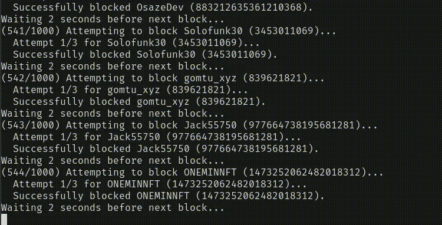

# BlockLoudest

> 🛑 A script to block the Loudest(Loudtardio accounts) that polluting your feed on X (formerly Twitter).

**BlockLoudest** is a simple automation tool that helps you instantly block "Loudtardio" accounts — the ones yelling/shitpoting all day with low effort, just to setup posting tickers/ads on your screen later, they are basiclly just CT ads.

## 🧠 How It Works

BlockLoudest pull stayloud.io leaderboard accounts and automatically blocks them via the X API.

## ⚙️ IUsage

# 🔐 Authorization

BlockLoudest uses your existing Bearer token and cookies from your browser session. No API key required.

- You need dump your cookies to cookies.txt in Netscape formatted (P.S you may need update your X Bearer token in the main.py file)
- then `python main.py --cookies cookies.txt`

## ⚠️ Warn

The daily maximum blocking limit on X (Twitter) should be around 500. Make sure you haven't reached the daily rate limit.

## ⚠️ Disclaimer

- This script is for **personal use only**.
- Use responsibly and in accordance with X’s [Terms of Service](https://twitter.com/en/tos).
- The term "Loudtardio" is used humorously. Please avoid targeting individuals based on ideology, identity, or personal beliefs.

## 📄 License

MIT License. Do whatever you want.

---

### 👤 Created by: yapein
Pull requests welcome. Quiet feeds forever.
